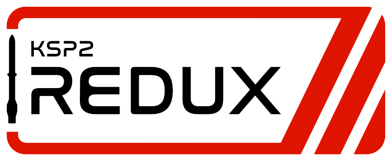

# KSP2 Redux
KSP2 Redux is a free, community-made mod for the game Kerbal Space Program 2, aiming to continue the development of the game and implement most of the game's original roadmap.

## Planned features
You can find our roadmap [here](roadmap.md). Please note that this roadmap is subject to change as the project evolves.

## How can I contribute?
We are always looking for contributors to help us bring KSP2 Redux to life! Whether you're an artist, developer, or translator, there are many ways to get involved. Please see our [contributing guide](contributing.md) for more information on how you can help.

## Contact
You can reach us most easily on the KSP2 Modding Society Discord server: [https://discord.gg/8yq8d5VGQR](https://discord.gg/8yq8d5VGQR).

## Redux Beta

We are currently in the beta testing phase of our first release of the Foundation stage. It is not intended to represent the finished product, so please, keep that in mind, as it's very likely some things will be broken, and report any bugs that you
suspect Redux has created that were not present in the original game.

You will not be able to update an existing beta build when the next beta build or stable release comes out; a new, fresh install of Redux will be required.

**Before asking questions, please make sure you've read this whole document.**

### Changelog
You can find the changelog for any build under its entry on the [Releases page](https://github.com/KSP2Redux/Redux/releases).

### Reporting bugs
Please, help us by reporting Redux bugs by submitting a bug report in the game (Ctrl+B or Escape -> Report Redux Bug) or in the #🟡redux-bugs channel on the KSP2 Modding Society Discord server.

**It will help us immensely if you attach any relevant screenshots, videos, log files, saves, vessel files, etc.**

### Mods
Due to the transition from BepInEx to an integrated mod loader, as well as some improvements to the modding API, do not expect current mods to work at this point. It is possible that some asset-only (part) mods will work out of the box, but we do not guarantee it. We are currently in the process of working on the modding documentation, helping modders with updating their mods, and updating unmaintained mods ourselves.

### Installing
1. Download the latest prerelease build archive from [the Releases page](https://github.com/KSP2Redux/Redux/releases).
2. Extract the contents of the archive to a temporary folder.
3. Create an empty folder where you want to install Redux. Keep in mind that the whole game will be copied to this folder, so make sure you have enough free space (at least 32 GB recommended). Choosing a location on a different drive than your original KSP2 installation will likely result in much slower installation times, so it's recommended to use the same drive.
4. Run Ksp2Redux.Tools.Installer.exe. This is an internal dev tool so it's very barebones, the actual Installer/Updater will come with the first stable release.
5. Click on the Browse button next to "KSP2 Install Folder" and select the folder where you have stock KSP2 v0.2.2.0 installed (it **MUST** be this latest official version).
6. Click on the Browse button next to "Target Folder" and select the folder that you created in step 3, where Redux will be installed. **Avoid installing Redux inside the original Kerbal Space Program 2 folder**.
7. Click on the Browse button next to "Patch File" and select the appropriate patch file from this download:
   - If you downloaded the game through Steam, use the "Ksp2Redux-steam-release-vX-Y-Z-xxxxxxxx.patch" file (you can check if you have a Steam install by looking for the file `Kerbal Space Program 2/KSP2_x64_Data/Plugins/Steamworks.NET.txt`),
   - If you downloaded the game through Epic Game Store, use the "Ksp2Redux-epic-release-vX-Y-Z-xxxxxxxx.patch" file (you can check if you have an EGS install by looking for the folder `Kerbal Space Program 2/.egstore`),
   - If you downloaded the game from the Private Division website, use the "Ksp2Redux-portable-release-vX-Y-Z-xxxxxxxx.patch" file.
8. Click Update/Install and wait for a dialog window to pop up that will say the patching is finished (depending on the speed of your disk, this may take a while).
9. Open the folder you specified as "Target Folder" and run KSP2_x64.exe to start the game.

### Uninstalling
Simply delete the folder with your Redux install (the one you specified as "Target Folder" during the patching).
